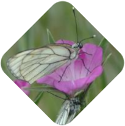

<h1 align="center">
   FELLOW Workshop 2 
</h1>

 

  
  

  <a href="#content">Content</a> •
  <a href="#contribute">Contribute</a> •
  <a href="#reuse">Reuse</a> •
  <a href="#citation">Citation</a> •
  <a href="#see-also">See also</a>

 

## Content

Three online presentations for workshop 2 of FRB-CESAB group [FELLOW](https://www.fondationbiodiversite.fr/la-frb-en-action/programmes-et-projets/le-cesab/fellow/).

<h1 align="center">
   
  
   Introduction to git and Github 
</h1>

<h1 align="center">
   
  
   Trait database 
</h1>

<h1 align="center">
   
  
   Environment databases 
</h1>

 

## Contribute

If you see mistakes or want to suggest changes, please [create an issue](https://github.com/FELLOW-flora/slides-ws2/issues/new) on the source repository.

## Reuse

Text and figures are licensed under Creative Commons Attribution [CC By 4.0](https://creativecommons.org/licenses/by/4.0/), unless otherwise noted.

## Citation

Please cite these presentations as:

> Frelat R and Casajus N (2025) Version control with git and GitHub. URL: <https://fellow-flora.github.io/intro-git.html>

> Frelat R, Barkaoui K, and Kazakou E (2025) Traits database - quick update and way forward. URL: <https://fellow-flora.github.io/fellow-traits.html>

> Frelat R, Coux C, and Casajus N (2025) Environment databases frequently used in biodiversity research. URL: <https://fellow-flora.github.io/env-data.html>  

## See also

Discover the other training courses provided by the FRB-CESAB and its partners: <https://frbcesab.github.io/training-courses/>